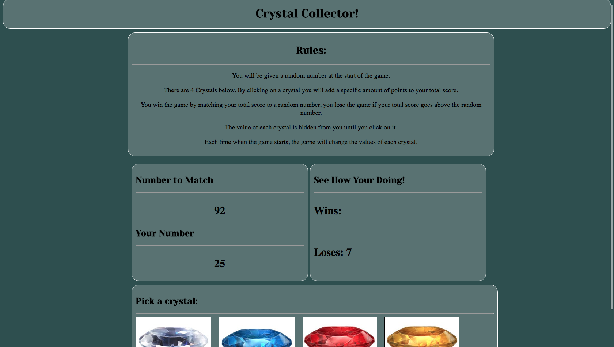

# unit-4-game
Crystal Collector Game Made with jQuery

* How the game works

1. The computer generates a random number on the screen.

2. There are 4 crystals on the bottom of the page.

3. The user has to click on the crystals to try and make their numbers match the number the computer generated. 

4. The value each crystal holds is hidden from the user till they click on the crystal.

5. If the user goes over the number the computer had generated it is a loss if the user matches the number then it is a win. 

6. After a win or loss is declared the game will restart on its own. Do not manually refresh the page as the tally of score will be lost. 

* How to make the game

1. Create var for the game

2. Create the randomization of the computer generated number

3. Create the random values for the crystals

4. Have the score table keep adding the score

5. Create the div that shows what number you are at from clicking on the crystals. 